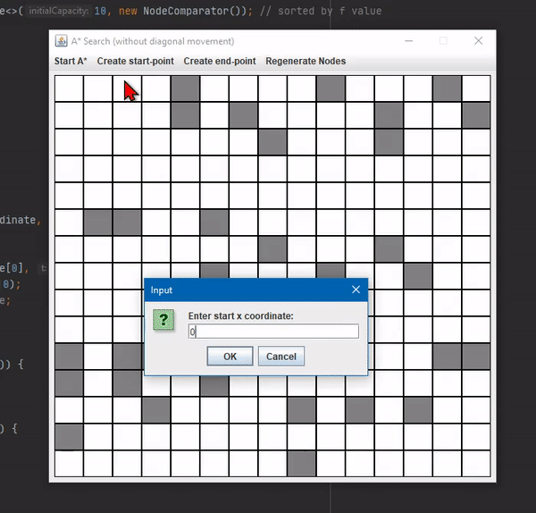

# A*
GUI implementation of the A* path finding algorithm
- the green tile represents the start node
- the red tile represents the goal node
- gray tiles represent unpathable nodes
- orange tiles represent nodes in the open list
- blue tiles represent the parent node connection from the goal to start node in the closed list

⭐️ Author [Brandon](https://github.com/btror)
